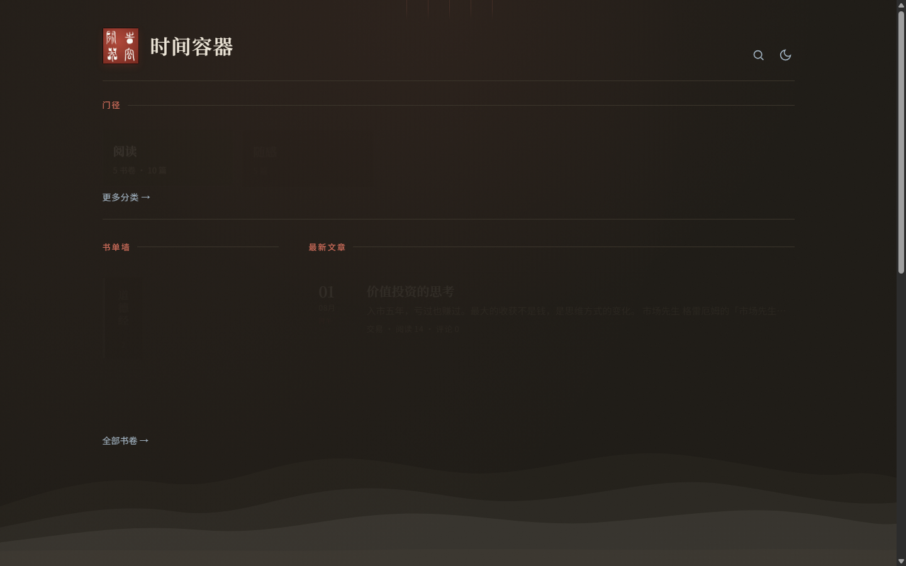
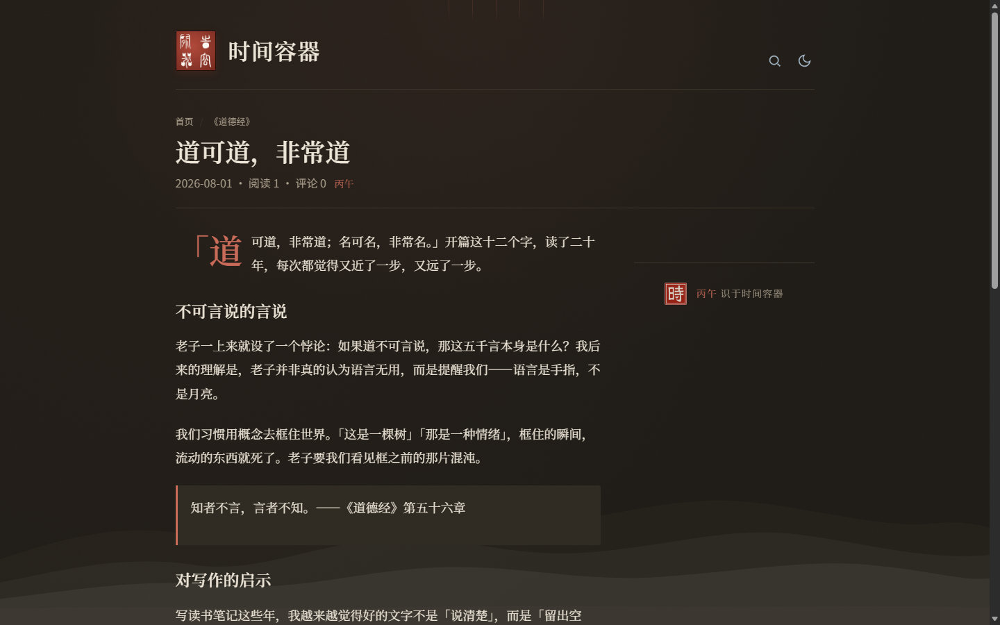
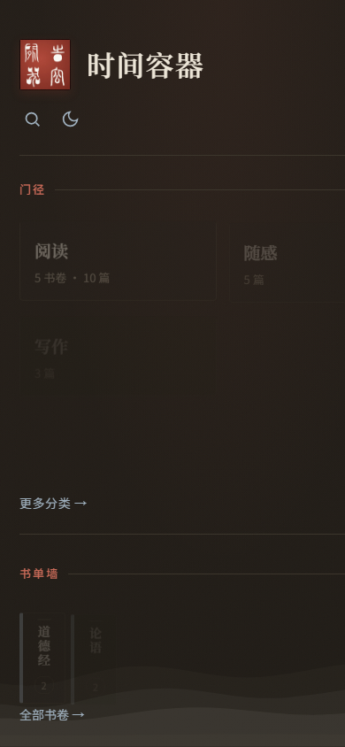
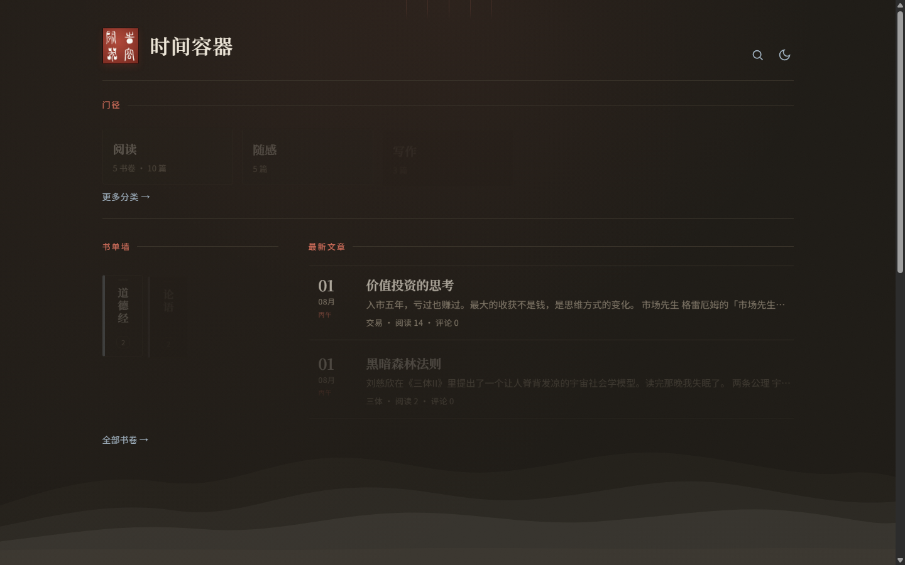

# 时间容器 · Time Capsule

书卷气、高密度、为长期写作而生的个人图书馆式 Halo 主题。

> 在字里行间，安放流逝的时间。

- 适配 Halo `>= 2.22.0`（Thymeleaf 模板引擎）
- 编辑器感极简 + 纸感暖调，衬线标题 / 正文，适合长文沉浸阅读
- 一级分类做「图书馆入口」，「阅读」下的每个子分类即一本书
- 内置 Navidrome（Subsonic）右下悬浮迷你播放器，不自动播放
- 自带亮 / 暗双配色（跟随系统，可手动切换并记忆）

设计约束、Halo API、已知坑与运维备忘见 **[docs/CONTEXT.md](docs/CONTEXT.md)**（后续优化请先读）。

---

## 截图

| 桌面端首页 | 桌面端文章页 |
|---|---|
|  |  |

| 移动端首页 | 暗色模式 |
|---|---|
|  |  |

---

## 一、目录结构

```
time-capsule/
├── theme.yaml
├── settings.yaml
├── annotation-settings.yaml    # 分类「作者 / ISBN」后台表单
├── pack.ps1                    # 打可上传 zip（Linux 安全路径）
├── tools/book-fill/            # 本机半自动填书目封面/作者/简介（不必上服务器）
├── README.md
├── docs/CONTEXT.md
└── templates/
```

书目元数据半自动填写见 **[tools/book-fill/README.md](tools/book-fill/README.md)**（本机 Python，不部署到 Halo）。

---

## 二、安装部署

**方式 A · 后台上传（推荐）**
1. 进入 `time-capsule/` 目录，把**里面的内容**（`theme.yaml`、`settings.yaml`、`templates/`）打成 zip —— 注意 `theme.yaml` 要在 zip 的第一层，不要再套一层 `time-capsule/` 文件夹。
2. Halo 后台 → **外观 → 主题 → 安装主题 → 上传**，选择该 zip。
3. 启用「时间容器」。

**方式 B · 服务器目录**
1. 把整个 `time-capsule/` 目录拷到 Halo 数据目录的 `themes/` 下（如 `~/.halo2/themes/time-capsule`）。
2. 后台 → 外观 → 主题 → **重载主题配置**，启用。

## 三、主题设置（外观 → 主题设置）

上传新版本后请先「重载主题配置」。

**基础文案**
- 顶栏题记/格言、页脚格言、归档副标题、备案号、是否显示 Powered by Halo
- **顶栏方印**：默认篆书四字印「时间容器」（门楣大图）；可在 **品牌形象** 上传替换
- **小印「時」**：用于文末落款，以及开启「用主题印章作标签图标」且未上传自定义时的 favicon
- **站点标题**在「系统设置 → 基本设置」修改
- **正文字体**默认「书卷」；设置里还可选全卷 / 墨韵（霞鹜文楷优化）/ 编辑器 / 自定义上传
- **书单墙阅读分类别名**：默认 `yue-du`。该一级分类下每个**子分类 = 一本书**

**如何把文章归进某本书（例：稀罕）**
1. 文章 → 分类：建好父分类「阅读」（别名与主题设置一致，如 `yue-du`）
2. 在「阅读」下新建子分类，显示名写「稀罕」（不必加《》；主题也不再自动加书名号）
3. 写文章 / 编辑文章时，在分类里**勾选子分类「稀罕」**（不要只勾「阅读」）
4. 发布后：首页书单墙可点进「稀罕」，该书时间线里会出现这篇文章

**区块标题 / 显示开关**：首页各区块文案与是否显示，均可在主题设置里改。

**音乐播放（Navidrome）**
- 地址须为 HTTPS；用户名 / 密码 / 歌单 ID；自动播放建议保持关闭。

## 四、信息架构与书单页

- **首页**：分类卡片导航（一级分类）→ 精华区（后台**置顶**的文章）→ 左「书单墙」（阅读分类下的书）+ 右高密度文章流。
- **分类主页**（如 `/categories/yue-du`，即含子分类的一级分类）：自动渲染子分类筛选条 + 紧凑文章列表。
- **书单页**（如 `/categories/yuan-jiu-shi-zhu`，即某本书）：自动以「封面 + 书名 + 该书文章时间线」渲染。在分类设置里给该子分类**上传封面图**即可显示书封，未上传则用纯色书封 + 书名兜底。
- **判断逻辑**：在「阅读」根（`book_category_slug`）下的叶子分类 → 书单页；其余有子分类 → 分类主页，无子分类（如随感）→ 普通文章列表。无需手工指定模板。

## 五、音乐播放（Navidrome）

播放器通过 Subsonic REST API 读取指定歌单并流式播放。

1. **地址**：优先填同域反代 `https://blog.xybkwd.top/tc-music`（无跨域）；也可填 `https://music.xybkwd.top`。不要填 `http://IP:4533`。
2. **CORS**：直连音乐子域时依赖 Navidrome 透传的 `Access-Control-Allow-Origin`；Caddy **不要**再加同名头（双写会被浏览器拒）。运维细节见 `docs/CONTEXT.md`。
3. **账号**：请务必使用**只读 / 受限**账号。密码在前端以 `enc:hex` 编码传输。
4. 在主题设置填入地址 / 用户名 / 密码 / 歌单 ID；首页显示「此刻在听」。重载主题配置后若播不了，请重新保存用户名密码。

## 六、明暗配色

默认跟随系统（`prefers-color-scheme`）；顶栏月亮图标可手动切换，选择经 `localStorage` 记忆。无需额外配置。

## 七、评论

文章页预留了 Halo 评论组件位（`<halo:comment>`）。安装并启用评论插件（如 comment-widget）后自动渲染；未安装则不显示，不影响其它功能。

## 第三方服务与资源

- **Navidrome（可选）**：右下角迷你播放器通过 Subsonic API 读取你自己部署的 Navidrome 服务。不填配置则不启用，不涉及任何第三方数据。凭证在前端以 `enc:hex` 编码传输，请务必使用只读账号。
- **字体（自托管，OFL 许可）**：Noto Serif SC / Noto Sans SC、霞鹜文楷（LXGW WenKai）均随主题打包自托管，不加载外部 CDN。
- 主题不含统计、广告或追踪脚本。

## 卸载

1. 后台 → 外观 → 主题 → 先切换回其他主题。
2. 在主题列表中删除「时间容器」。主题不修改站点内容，卸载后文章、分类、标签、附件等数据全部保留。

## 故障排查

- **首页书单墙篇数全为 0**：检查文章是否勾选挂到了「阅读」下对应的书子分类（只勾「阅读」父分类不算）。
- **音乐播放失败**：确认地址为 HTTPS；在主题设置重新保存一次账号密码。
- **样式不生效**：浏览器强刷（Ctrl+Shift+R）；若仍旧，确认主题版本号已更新（`?v=` 会随版本变化）。
- **单页打不开 / 空白**：确认后台已发布该单页，且主题为最新版本（含 `page.html` 模板）。

## 许可证

[GPL-3.0](LICENSE)

---

Powered by Halo · 主题「时间容器」
